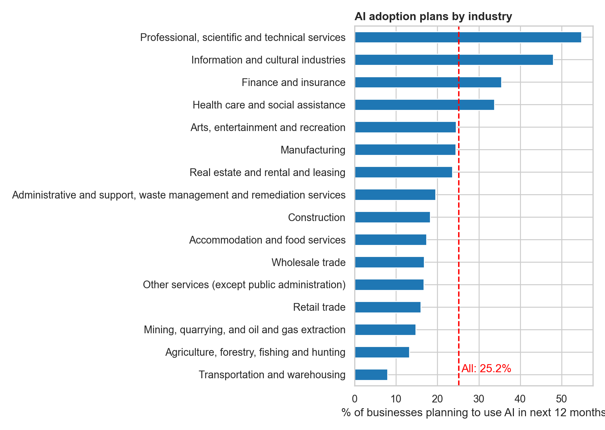

# Canada AI Adoption: Who Plans to Use AI? (Q3 2026)

Analysis of which Canadian businesses and organizations plan to use artificial intelligence in the next 12 months, using Statistics Canada survey data.

**Tools:** Python (pandas, matplotlib, seaborn), SQL (SQLite), Jupyter, Git

## Business questions
1. Which industries are most and least likely to plan AI use?
2. Does business size or age matter?
3. Which AI tools are businesses planning to use?
4. How big is the urban vs rural gap?
5. How reliable are the estimates?

## Key findings
- **Industry gap:** Professional, scientific and technical services leads at 54.8%, while transportation and warehousing trails at 8.0%. The all-industry average is 25.2%.
- **Size:** Organizations with 100+ employees plan AI use at 37.5%, compared with 21.0% for those with 5 to 19 employees.
- **Age:** Newer businesses are more likely to plan AI use. Businesses 2 years old or less are at 32.8%, versus 18.5% for businesses more than 20 years old.
- **Urban vs rural:** Urban businesses are at 27.4%, while rural businesses are at 13.5%, about half the rate.
- **Tools:** Data analytics (41.7%) and large language models (39.3%) are the most planned tools.

## Data quality
Statistics Canada grades every estimate from A (excellent) to F (too unreliable to publish). The notebook keeps these grades, and grey bars in the charts mark estimates graded E ("use with caution"). Small-group results should be read carefully.

## Method
1. Loaded the raw Statistics Canada table and separated each value from its quality grade
2. Treated "F" and ".." values as missing
3. Grouped rows into industry, size, age, geography and ownership
4. Built charts in Python and answered questions with SQL queries

## Project structure
- `data/raw`: original Statistics Canada file
- `data/processed`: cleaned versions
- `notebooks`: analysis notebook
- `docs`: chart images
- `sql`: SQL queries

## Data source
Statistics Canada, Table 33-10-1207-01, "Use of artificial intelligence by businesses or organizations in producing goods or delivering services over the next 12 months, third quarter of 2026"
https://www150.statcan.gc.ca/t1/tbl1/en/tv.action?pid=3310120701
